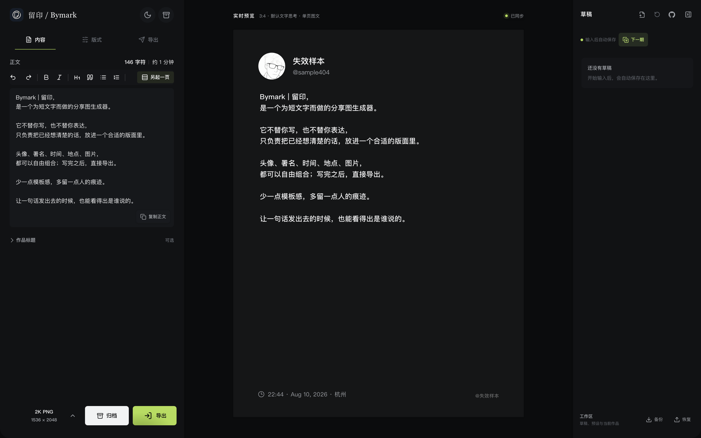
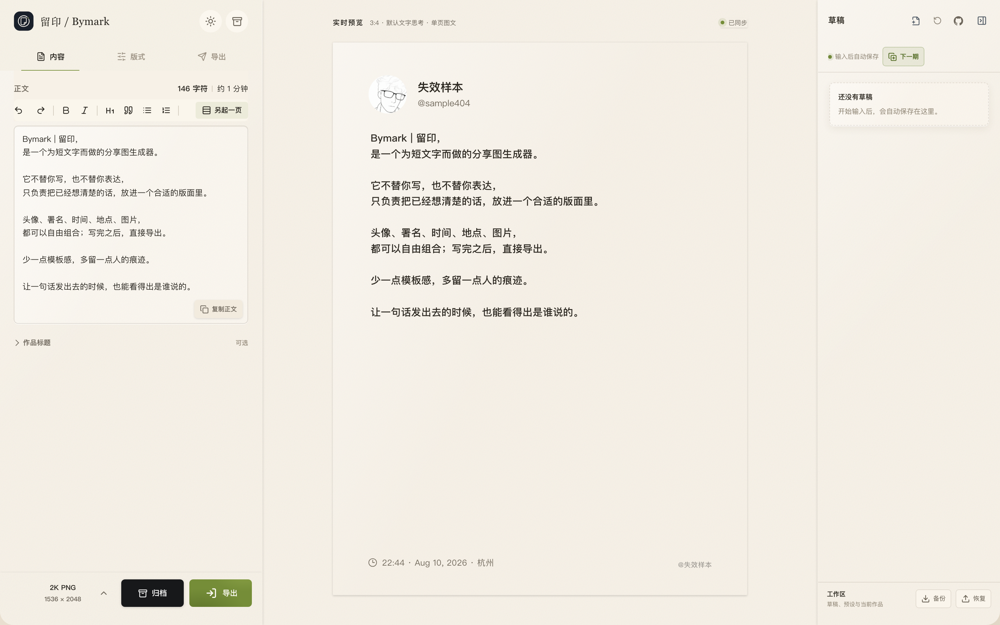
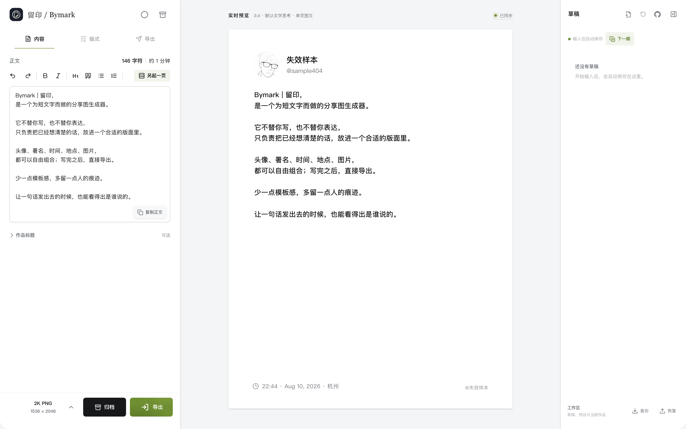

# Bymark｜留印

[English](README.en.md) · 中文

Bymark（留印）是为短文字创作者设计的个人化分享图生成器。它不替你写，也不替你表达——只把你已经写好的观点、片段和感受，排成一张带有个人印记的分享图。头像、署名、时间、地点、图片与版式，都能按你的方式组合；写完后直接导出，让短文字带着作者身份一起传播。少一点模板感，多留一点人的痕迹，让一句话发出去的时候，也能看得出是谁说的。

## 界面预览

### 夜色模式



### 暖纸模式



### 净白模式



## 功能

- 实时编辑与预览：正文、作者、时间、地点、头像和配图修改后立即反映到卡片；正文区提供撤销、重做和字符统计。
- Markdown 写作：支持一至三级标题、引用、无序/有序列表、加粗和斜体，并可复制不带 Markdown 标记的纯正文。
- 连续图文导演台：长文自动分页后可总览每页摘要与文字密度、固定或恢复分页起点，并一次导出全部页面。
- 发布画幅：提供 `3:4`、`2:3`、`9:16` 和“抖音封面”模式，覆盖常用图文发布比例。
- 场景图片模式：使用全幅背景图和固定悬浮卡片，可调整画面焦点、卡片位置与遮罩。
- 高清导出：支持 PNG、JPG 格式，以及 `1K`、`2K`、`3K`、`4K` 分辨率；可复制当前页图片。
- 一键准备发布：支持系统分享面板；不支持时自动复制纯正文并下载单图或多页 ZIP。
- 本地草稿：草稿自动保存，可新建、打开、重命名、删除和恢复。
- 下一期：从当前作品派生独立草稿，保留作者与版式，并清空正文与内容素材。
- 设置预设：保存常用作者资料、画幅、主题和版式设置，后续一键复用。
- 工作区备份：将当前作品、草稿和设置预设备份为 JSON，并在其他浏览器恢复合并。
- 三种主题与移动端适配：深色、暖白、纯白三套主题；桌面和手机端都可以完成编辑和导出。

首次打开会展示项目内置的示例文案、作者资料和发布设置。示例只用于初始化，不会覆盖之后保存在本机的内容。

## 本地运行

前置条件：Node.js 当前 LTS 版本和 npm。

```bash
git clone <你的仓库地址>
cd Bymark
npm install
npm run dev
```

启动后打开终端提示的地址，通常是 `http://localhost:5173`。

## 生产构建与部署

Bymark 是没有后端依赖的 Vite 静态应用。构建产物位于 `dist/`，可以部署到 Vercel、Netlify、Cloudflare Pages、GitHub Pages 或任意静态文件服务器。

```bash
npm run build
npm run preview
```

常见平台配置：

| 平台 | Build command | Output directory |
| --- | --- | --- |
| Vercel / Netlify / Cloudflare Pages | `npm run build` | `dist` |
| GitHub Pages | `npm run build` | `dist` |
| 自有静态服务器 | 在本地构建后上传 `dist/` | `dist` |

当前项目没有必需的环境变量，也没有服务端 API。若部署在非根路径，需要额外配置 Vite 的 `base` 路径，并同步检查图标、Manifest 和资源地址。

## 常用命令

```bash
# TypeScript 检查并生产构建
npm run build

# ESLint
npm run lint

# 单元检查
npm run unit

# 浏览器端功能与界面回归检查
npm run qa

# 预览生产构建
npm run preview
```

首次运行浏览器检查时，如果本机尚未安装 Chromium，可执行：

```bash
npx playwright install chromium
```

也可以让 QA 检查已运行的站点：

```bash
BYMARK_URL=http://127.0.0.1:4173 npm run qa
```

## 技术栈

- Vue 3 + TypeScript
- Vite
- `html-to-image`：将卡片导出为图片
- Lucide：界面图标
- Playwright：浏览器端回归检查

## 项目结构

```text
src/
  components/       编辑器、预览、草稿和模板组件
  App.tsx           应用编排、自动保存、分页和图片导出
  drafts.ts         IndexedDB 草稿读写与快照逻辑
  brandTemplates.ts 本地设置预设读写逻辑
  markdown.tsx      Markdown 渲染与纯正文复制
  pagination.ts     长文分页与手动分页标记
  workspace.ts      工作区备份格式与合并逻辑
  bymark.ts         编辑器状态、本地设置和图片存储
public/             网站图标、默认头像和 PWA Manifest
docs/images/        README 预览图
tests/              单元检查与浏览器 QA
```

## 数据与隐私

Bymark 没有后端服务。设置保存在浏览器 `localStorage`，草稿、设置预设和图片资源保存在 IndexedDB，数据只留在当前浏览器。数据不会自动同步到云端；清除浏览器站点数据会删除这些内容，请使用工作区备份保留可迁移副本。

部署前建议确认：

- 生产构建、Lint、单元检查和 QA 全部通过。
- 目标平台可以正确托管 `dist/` 下的静态资源。
- 用户是否需要跨设备同步或云端备份；当前版本提供手动工作区备份，不提供云端同步。
- 如果使用 GitHub Pages 等子路径部署，补充 Vite `base` 配置并验证资源路径。

## 许可证

本项目采用 [MIT License](LICENSE) 开源。Copyright © 2026 Rainxen。
